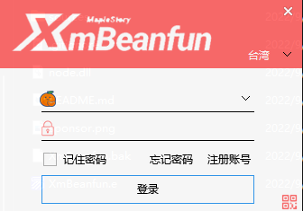

# XmBeanfun 登录器

## 前言

XmBeanfun 小梦登录器，是一款新枫之谷登入工具。

主要支持[香港橘子][台湾橘子]账号登录、台湾区域模拟运行游戏等

目前仅由小梦维护更新，目前进度：迭代更新中。



## 下载/使用

[请移步Releases下载](https://github.com/starmcc/XmBeanfun/releases)

由于易语言的特性，部分杀软会对其进行误判、报毒等问题，建议手动添加信任

工具会在当前目录下生产sources目录和node.dll文件作为依赖

建议创建一个目录来放置本登录器

## 依赖

本工具由易语言开发

1. [精益模块-10.3.5](http://ec.125.la/)
2. [EXUI++界面库-20220526 VIP](https://www.iexui.com/)
3. [InWILL/Locale_RemulatorV1.4.3](https://github.com/InWILL/Locale_Remulator)
4. [纸娃娃系统（MapleStory-GM-Client-Github）](https://github.com/Elem8100/MapleStory-GM-Client)
5. [鱼刺类_HTTPv5.0_稳定版本19 请求工具](https://bbs.125.la/forum.php?mod=viewthread&tid=13989083)

## 安全问题

每次更新会在发布`Releases`当中贴出工具的(Hash)哈希值

烦请下载登录器后校验Hash值是否安全

怎么查询哈希值？

```
certutil -hashfile 该程序路径
```

回车后会出现hash值。

**熟悉易语言的朋友可以自行下载源码自行编译**

## 犒劳打赏

免费开源实属不易，需要大量的时间、精力去调试和维护。

如果您资金充裕，望君能慷慨解囊给与我一些鼓励与支持。

每一笔打赏，都将让小梦铭记于心，感恩有你。


## 结语

1. 所有不怀好意的指责，都需要时间去验证。
2. 能够帮助别人，分享自己的技术实现方案是一件非常愉快的事情，也希望有一些朋友一起学习，一起优化它，让它更人性化。
3. 凡是登录器(第三方工具)，都是橘子官方明令不允许使用的，最好就是将系统转为繁体语言后使用网页登录，望客官悉知。
4. 我只是茫茫人海中一个热爱枫谷懂点皮毛技术的玩家，希望新枫之谷会一直运营下去，长盛不衰！
5. **工具仅供学习使用，下载后请24小时内删除，遵循MIT开源协议**

> 枫谷作伴，潇潇洒洒...